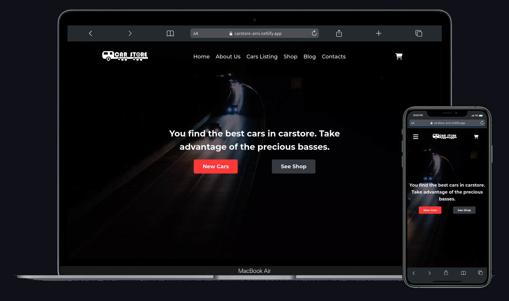

## CARSTORE

1. Descargar el proyecto y abrir una terminal con la ruta del mismo.
2. Ejecutar el comando npm install
3. Si se quiere modificar los estilos css o el archivo js se debe ejecutar el comando gulp

